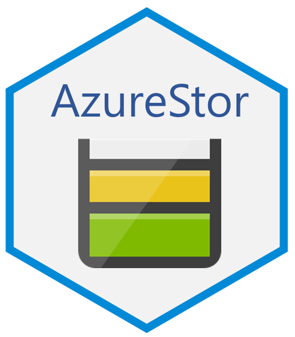

# AzureStor 

[](https://cran.r-project.org/package=AzureStor)


This package implements both an admin- and client-side interface to [Azure Storage Services](https://docs.microsoft.com/en-us/rest/api/storageservices/). The admin interface uses R6 classes and extends the framework provided by [AzureRMR](https://github.com/Azure/AzureRMR). The client interface provides several S3 methods for efficiently managing storage and performing file transfers.

The primary repo for this package is at https://github.com/Azure/AzureStor; please submit issues and PRs there. It is also mirrored at the Cloudyr org at https://github.com/cloudyr/AzureStor. You can install the development version of the package with `devtools::install_github("Azure/AzureStor")`.

## Storage endpoints

The interface for accessing storage is similar across blobs, files and ADLSGen2. You call the `storage_endpoint` function and provide the endpoint URI, along with your authentication credentials. AzureStor will figure out the type of storage from the URI.

AzureStor supports all the different ways you can authenticate with a storage endpoint:

- Blob storage supports authenticating with an access key, shared access signature (SAS), or an Azure Active Directory (AAD) OAuth token;
- File storage supports access key and SAS;
- ADLSgen2 supports access key and AAD token.

In the case of an AAD token, you can also provide an object obtained via `AzureAuth::get_azure_token()`. If you do this, AzureStor can automatically refresh the token for you when it expires.

```r
# various endpoints for an account: blob, file, ADLS2
bl_endp_key <- storage_endpoint("https://mystorage.blob.core.windows.net", key="access_key")
fl_endp_sas <- storage_endpoint("https://mystorage.file.core.windows.net", sas="my_sas")
ad_endp_tok <- storage_endpoint("https://mystorage.dfs.core.windows.net", token="my_token")

# alternative (recommended) way of supplying an AAD token
token <- AzureRMR::get_azure_token("https://storage.azure.com",
                                   tenant="myaadtenant", app="app_id", password="mypassword"))
ad_endp_tok2 <- storage_endpoint("https://mystorage.dfs.core.windows.net", token=token)
```

## Listing, creating and deleting containers

AzureStor provides a rich framework for managing storage. The following generics allow you to manage storage containers:

- `storage_container`: get a storage container (blob container, file share or ADLS filesystem)
- `create_storage_container`
- `delete_storage_container`
- `list_storage_containers`

```r
# example of working with containers (blob storage)
list_storage_containers(bl_endp_key)
cont <- storage_container(bl_endp_key, "mycontainer")
newcont <- create_storage_container(bl_endp_key, "newcontainer")
delete_storage_container(newcont)
```

## Files and blobs

These functions for working with objects within a storage container:

- `list_storage_files`: list files/blobs in a directory (defaults to the root directory)
- `create_storage_dir`/`delete_storage_dir`: create or delete a directory
- `delete_storage_file`: delete a file or blob
- `storage_file_exists`: check that a file or blob exists
- `storage_upload`/`storage_download`: transfer a file to or from a storage container
- `storage_multiupload`/`storage_multidownload`: transfer multiple files in parallel to or from a storage container
- `get_storage_properties`: Get properties for a storage object
- `get_storage_metadata`/`set_storage_metadata`: Get and set user-defined metadata for a storage object

```r
# example of working with files and directories (ADLSgen2)
cont <- storage_container(ad_endp_tok, "myfilesystem")
list_storage_files(cont)
create_storage_dir(cont, "newdir")
storage_download(cont, "/readme.txt")
storage_multiupload(cont, "N:/data/*.*", "newdir")  # uploading everything in a directory
```

## Uploading and downloading

AzureStor includes a number of extra features to make transferring files efficient.

### Parallel connections

As noted above, you can transfer multiple files in parallel using the `storage_multiupload/download` functions. These functions utilise a background process pool supplied by AzureRMR to do the transfers in parallel, which usually results in major speedups when transferring multiple small files. The pool is created the first time a parallel file transfer is performed, and persists for the duration of the R session; this means you don't have to wait for the pool to be (re-)created each time.

```r
# uploading/downloading multiple files at once: use a wildcard to specify files to transfer
storage_multiupload(cont, src="N:/logfiles/*.zip")
storage_multidownload(cont, src="/monthly/jan*.*", dest="~/data/january")

# or supply a vector of file specs as the source and destination
src <- c("file1.csv", "file2.csv", "file3.csv")
dest <- file.path("data/", src)
storage_multiupload(cont, src=src, dest=dest)
```

### File format helpers

AzureStor includes convenience functions to transfer data in a number of commonly used formats: RDS, RData, TSV (tab-delimited), CSV, and CSV2 (semicolon-delimited). These work via connections and so don't create temporary files on disk.

```r
# save an R object to storage and read it back again
obj <- list(n=42L, x=pi, c="foo")
storage_save_rds(obj, cont, "obj.rds")
objnew <- storage_load_rds(cont, "obj.rds")
identical(obj, objnew)  # TRUE

# reading/writing data to CSV format
storage_write_csv(mtcars, cont, "mtcars.csv")
mtnew <- storage_read_csv(cont, "mtcars.csv")
all(mapply(identical, mtcars, mtnew))  # TRUE
```

### Transfer to and from connections

You can upload a (single) in-memory R object via a _connection_, and similarly, you can download a file to a connection, or return it as a raw vector. This lets you transfer an object without having to create a temporary file as an intermediate step.

```r
# uploading serialized R objects via connections
json <- jsonlite::toJSON(iris, pretty=TRUE, auto_unbox=TRUE)
con <- textConnection(json)
storage_upload(cont, src=con, dest="iris.json")

rds <- serialize(iris, NULL)
con <- rawConnection(rds)
storage_upload(cont, src=con, dest="iris.rds")

# downloading files into memory: as a raw vector with dest=NULL, and via a connection
rawvec <- storage_download(cont, src="iris.json", dest=NULL)
rawToChar(rawvec)

con <- rawConnection(raw(0), "r+")
storage_download(cont, src="iris.rds", dest=con)
unserialize(con)
```

### Copy from URLs (blob storage only)

The `copy_url_to_storage` function lets you transfer the contents of a URL directly to storage, without having to download it to your local machine first. The `multicopy_url_to_storage` function does the same, but for a vector of URLs. Currently, these only work for blob storage.

```r
# copy from a public URL: Iris data from UCI machine learning repository
copy_url_to_storage(cont,
    "https://archive.ics.uci.edu/ml/machine-learning-databases/iris/iris.data",
    "iris.csv")

# copying files from another storage account, by appending a SAS to the URL(s)
sas <- "?sv=...."
files <- paste0("https://srcstorage.blob.core.windows.net/container/file", 0:9, ".csv", sas)
multicopy_url_to_storage(cont, files)
```

### Appending (blob storage only)

AzureStor supports uploading to append blobs. An append blob is comprised of blocks and is optimized for append operations; it is well suited for data that is constantly growing, but should not be modified once written, such as server logs.

To upload to an append blob, specify `type="AppendBlob"` in the `storage_upload` call. To append data (rather than overwriting an existing blob), include the argument `append=TRUE`. See `?upload_blob` for more details.

```r
# create a new append blob
storage_upload(cont, src="logfile1.csv", dest="logfile.csv", type="AppendBlob")

# appending to an existing blob
storage_upload(cont, src="logfile2.csv", dest="logfile.csv", type="AppendBlob", append=TRUE)
```

### Interface to AzCopy

AzureStor includes an interface to [AzCopy](https://docs.microsoft.com/en-us/azure/storage/common/storage-use-azcopy-v10), Microsoft's high-performance commandline utility for copying files to and from storage. To take advantage of this, simply include the argument `use_azcopy=TRUE` on any upload or download function. AzureStor will then call AzCopy to perform the file transfer, rather than using its own internal code. In addition, a `call_azcopy` function is provided to let you use AzCopy for any task.

```r
# use azcopy to download
myfs <- storage_container(ad_endp_tok, "myfilesystem")
storage_download(myfs, "/incoming/bigfile.tar.gz", "/data", use_azcopy=TRUE)

# use azcopy to sync a local and remote dir
call_azcopy("sync", "c:/local/path", "https://mystorage.blob.core.windows.net/mycontainer", "--recursive=true')
```

For more information, see the [AzCopy repo on GitHub](https://github.com/Azure/azure-storage-azcopy).

**Note that AzureStor uses AzCopy version 10. It is incompatible with versions 8.1 and earlier.**


## Admin interface

Finally, AzureStor's admin-side interface allows you to easily create and delete resource accounts, as well as obtain access keys and generate a SAS. Here is a sample workflow:

```r
library(AzureStor)

# authenticate with Resource Manager
az <- AzureRMR::get_azure_login("mytenant")
sub1 <- az$get_subscription("subscription_id")
rg <- sub1$get_resource_group("resgroup")


# get an existing storage account
rdevstor1 <- rg$get_storage_account("rdevstor1")
rdevstor1
#<Azure resource Microsoft.Storage/storageAccounts/rdevstor1>
#  Account type: Storage 
#  SKU: name=Standard_LRS, tier=Standard 
#  Endpoints:
#    blob: https://rdevstor1.blob.core.windows.net/
#    queue: https://rdevstor1.queue.core.windows.net/
#    table: https://rdevstor1.table.core.windows.net/
#    file: https://rdevstor1.file.core.windows.net/ 
# ...

# retrieve admin keys
rdevstor1$list_keys()

# create a shared access signature (SAS)
rdevstor1$get_account_sas(permissions="rw")

# obtain an endpoint object for accessing storage (will have the access key included by default)
rdevstor1$get_blob_endpoint()
#Azure blob storage endpoint
#URL: https://rdevstor1.blob.core.windows.net/
# ...

# create a new storage account
blobstor2 <- rg$create_storage_account("blobstor2", location="australiaeast", kind="BlobStorage")

# delete it (will ask for confirmation)
blobstor2$delete()
```

---
<p align="center"><a href="https://github.com/Azure/AzureR"></a></p>
